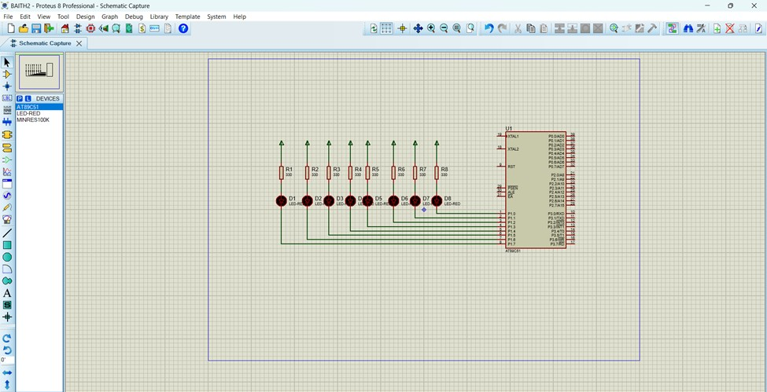
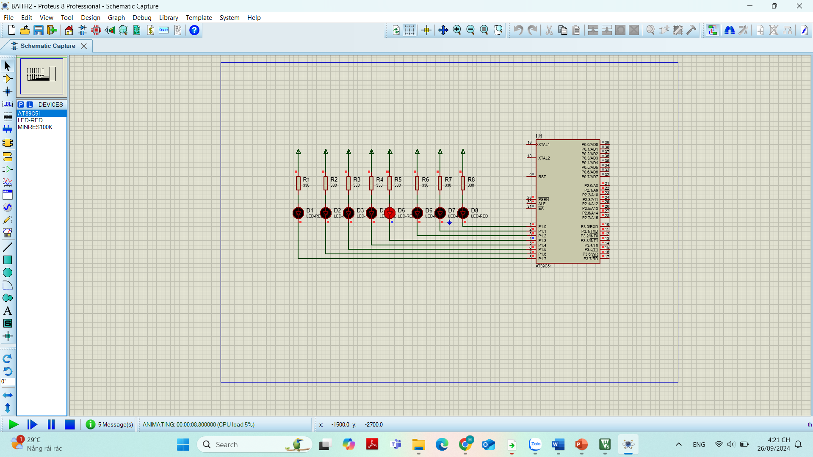
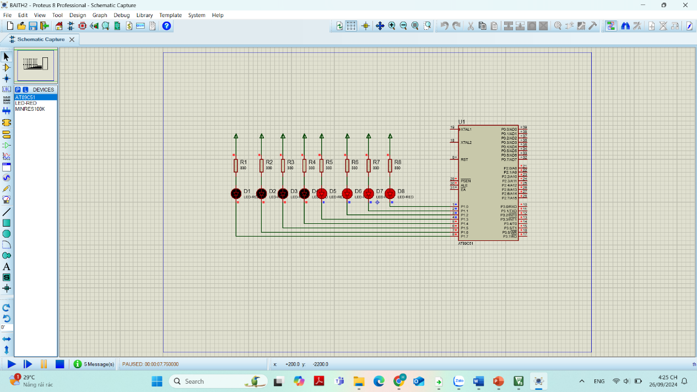
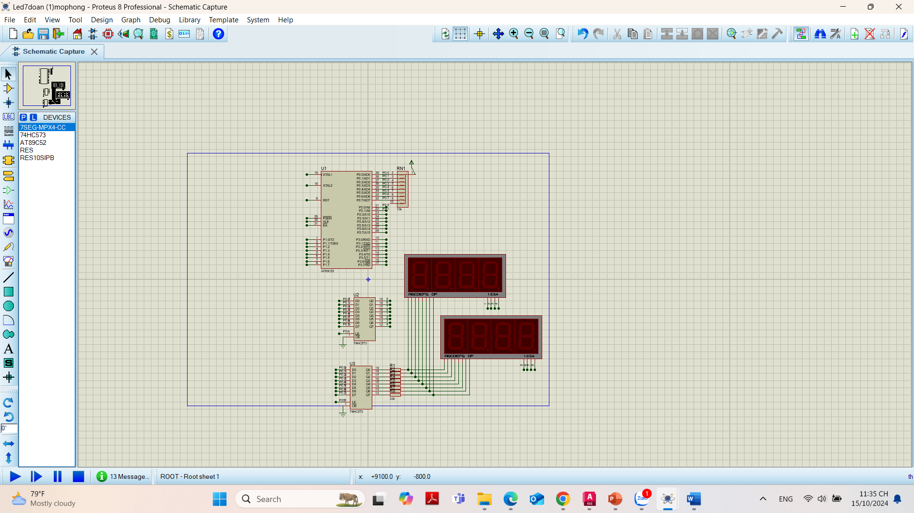
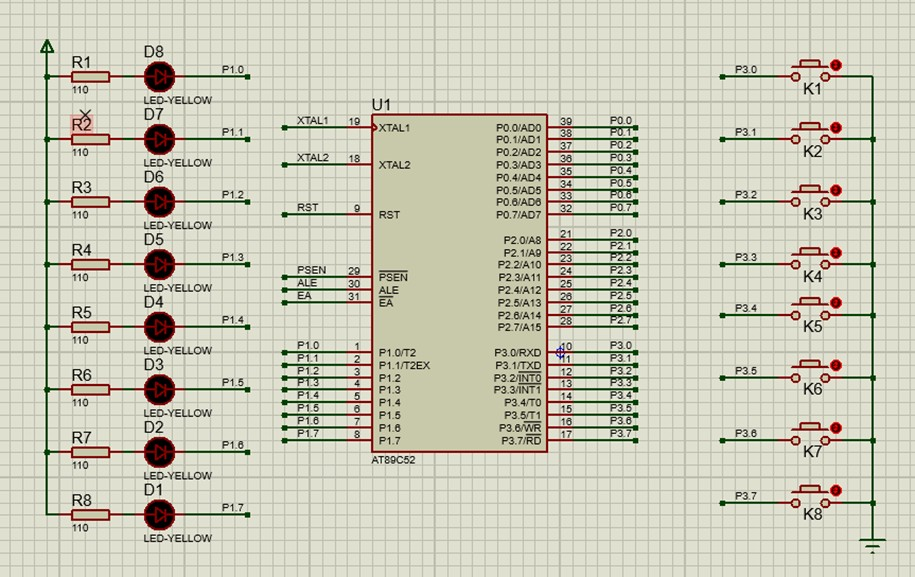
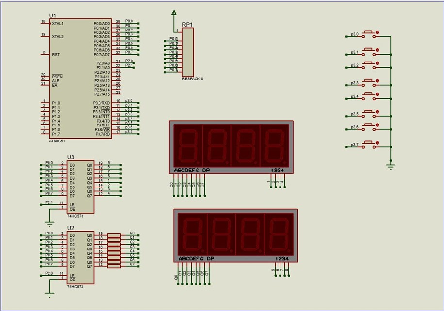
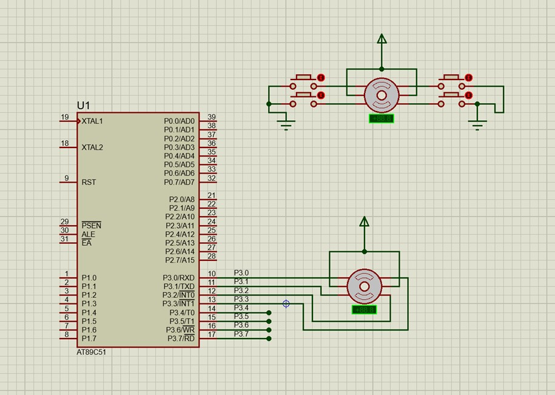
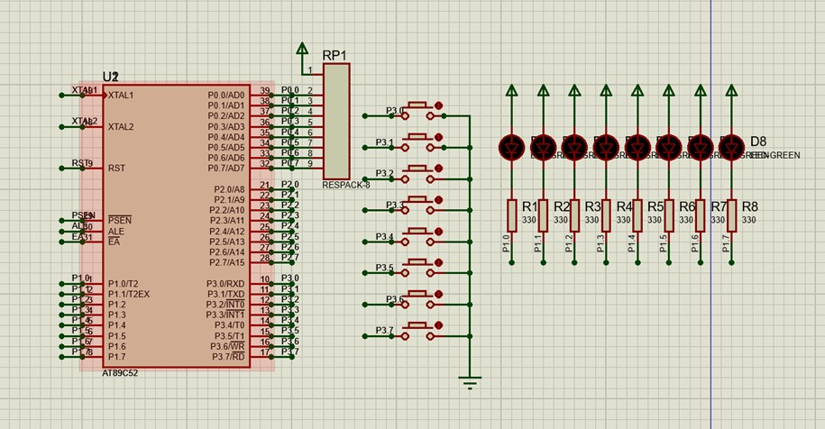

# 🔧 Kỹ Thuật Vi Xử Lý - IUH | Thực hành mô phỏng (Proteus + HEX)

> Repo lưu trữ các bài tập thực hành môn **Kỹ thuật Vi xử lý** tại **Đại học Công nghiệp TP.HCM (IUH)**.  
> Bao gồm **file mô phỏng Proteus** và **file HEX đã biên dịch sẵn**, phục vụ việc mô phỏng và ôn tập.

---

## 📂 Danh sách bài tập & yêu cầu

### 🟢 **Bài 1: THIẾT BỊ XUẤT NHẬP (LED ĐƠN)**

| Câu | Yêu cầu |
|-----|---------|
| 1 | Viết chương trình 1 điểm sáng chạy từ P1.0 → P1.7 rồi ngược lại P1.7 → P1.0, delay 0.5s dùng Timer 0. Thạch anh 12MHz |
| 2 | Viết chương trình tắt dồn LED P1, delay 0.3s dùng Timer 1. Thạch anh 12MHz |
| 3 | Viết chương trình sáng dồn và tắt dồn LED P1. Thạch anh 12MHz |

#### 📸 Hình ảnh minh họa
- Câu 1 
- Câu 2 
- Câu 3 

---

### 🔵 **Bài 2: ĐIỀU KHIỂN LED 7 ĐOẠN**

| Câu | Yêu cầu |
|-----|---------|
| 1 | Viết chương trình điều khiển LED 7 đoạn đếm từ 00 đến 59 |

#### 📸 Hình ảnh minh họa
- Câu 1 

---

### 🟠 **Bài 3: NÚT NHẤN**

| Câu | Yêu cầu |
|-----|---------|
| 1 | Nhấn P3.0 lần 1: sáng dồn LED P1, lần 2: sáng chạy LED P1, lần 3: chớp tắt LED P1, lần 4: dừng. Delay 0.3s sử dụng Timer 1. Thạch anh 12MHz |
| 2 | Nhấn P3.0 để đếm từ 00 đến 19, nhấn P3.1 đếm từ 00 đến 29. Quá trình lặp lại. Thạch anh 12MHz |

#### 📸 Hình ảnh minh họa
- Câu 1 
- Câu 2 

---

### 🟣 **Bài 4: ĐIỀU KHIỂN ĐỘNG CƠ BƯỚC**

| Câu | Yêu cầu |
|-----|---------|
| 1 | Viết chương trình động cơ bước quay **thuận 1 vòng → dừng 2s → quay nghịch 1 vòng**. Sử dụng Timer 1. Thạch anh 12MHz |

#### 📸 Hình ảnh minh họa
- Câu 1 

---

### 🔴 **Bài 5: NGẮT**

| Câu | Yêu cầu |
|-----|---------|
| 1 | Sử dụng ngắt ngoài 0 (P3.2): – Nhấn lần 1: chớp tắt LED P1 – Nhấn lần 2: chạy 1 điểm sáng từ P1.7 → P1.0 – Nhấn lần 3: sáng dồn LED P1 – Nhấn lần 4: dừng Delay 0.4s bằng Timer 1. Thạch anh 12MHz |
| 2 | Sử dụng INT0: – Nhấn lần 1: đếm từ 00 → 49 – Nhấn INT1: đếm từ 00 → 59 – Không nhấn gì: đếm từ 00 → 99 |

#### 📸 Hình ảnh minh họa
- Câu 1 
- Câu 2 

---

## 📁 Cấu trúc thư mục

Mỗi thư mục bài tập bao gồm:
- `.zip` – File mô phỏng Proteus
- `.txt` – File code, có thể chạy mô phỏng trên Prog Studio tạo ra file '.hex' rồi nạp trực tiếp vào vi điều khiển 8051

---

## 💻 Yêu cầu phần mềm

- **Proteus** (khuyên dùng từ phiên bản 8.0 trở lên)
- Vi điều khiển: **8051 / AT89C51**
- Không cần viết lại mã ASM/C nếu chỉ chạy mô phỏng từ file `.hex`

---

## 📌 Ghi chú

- Repo nhằm phục vụ học tập, mô phỏng, ôn tập hoặc chia sẻ với bạn học.
- Nếu bạn cần **source code đầy đủ** (ASM/C), có thể thêm sau theo yêu cầu.

---

## 📬 Liên hệ
**Người thực hiện:** Nguyễn Ngọc Hùng  
**Lớp/Khoa:** DHDTVT16A – Khoa CNTT hoặc Điện – Điện tử  
📧 Email: nguyenhung09052002@gmail.com
